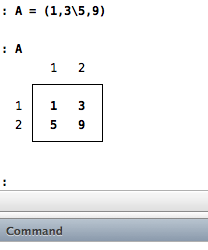
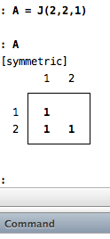

#Introduction
Mata is a high performance matrix language embedded within Stata\[[^1]\]. It 
provides a number of matrix operations that MATLAB users might be familiar
with. There are several tutorials\[[^2]\]\[[^3]\]\[[^4]\]\[[^5]\] available online, but for a 
comprehensive review of Mata, I would recommend StataCorp's own Mata 
documentation[^6] and Kit Baum's book[^7]. This page is a collection of
Mata miscellanny that I find useful. I hope that it turns out to be useful for
someone else as well. 

#Starting a Mata session
You can start an interactive Mata session within Stata by typing
`mata` in the command window. Similarly, you can end the 
session using the `end` command. Note that none of the Mata definitions and 
functions are lost after typing the `end` command. To completely clear your
Mata workspace, either start a new Stata session or use the `mata clear`
command.

To use Mata commands in your do file, simply wrap the relevant Mata commands
with `mata` and `end`!

#Matrix operations

##Creating matrices

Unlike plain Stata, there is no need to use `gen` commands to create variables
in Mata. There are 2 ways to create matrices (note that scalars are simply
special cases of matrices):

	A = (1,3\5,9)

This will create a matrix `A`. You can view the contents of matrix `A` by 
simply typing `A` in the command window:

To create matrices with identical entries, we will use the `J(...)` command
in Mata:

	A = J(2,2,1)

This creates a `2 x 2` matrix whose entries are all 1:

Note that for a symmetric matrix, Stata does not display the upper diagonal 
entries.

#References:

[^1]: [StataCorp Mata page](http://www.stata.com/features/overview/introduction-to-mata/) 
[^2]: [Kurt Schmidheiny's tutorial](http://kurt.schmidheiny.name/teaching/statamata2up.pdf) 
[^3]: [SSCC @ UWisc-Mad tutorial](http://www.ssc.wisc.edu/sscc/pubs/4-26.htm)
[^4]: [Kit Baum's tutorial](http://ideas.repec.org/p/boc/usug08/11.html) 
[^5]: [Bill Gould's tutorial](http://www.stata.com/meeting/chicago11/materials/chi11_gould.pdf) 
[^6]: [StataCorp's Mata manual](http://www.stata.com/manuals13/m.pdf) 
[^7]: [Kit Baum's book](http://www.amazon.com/Introduction-Stata-Programming-Christopher-Baum/dp/1597180459/) 
